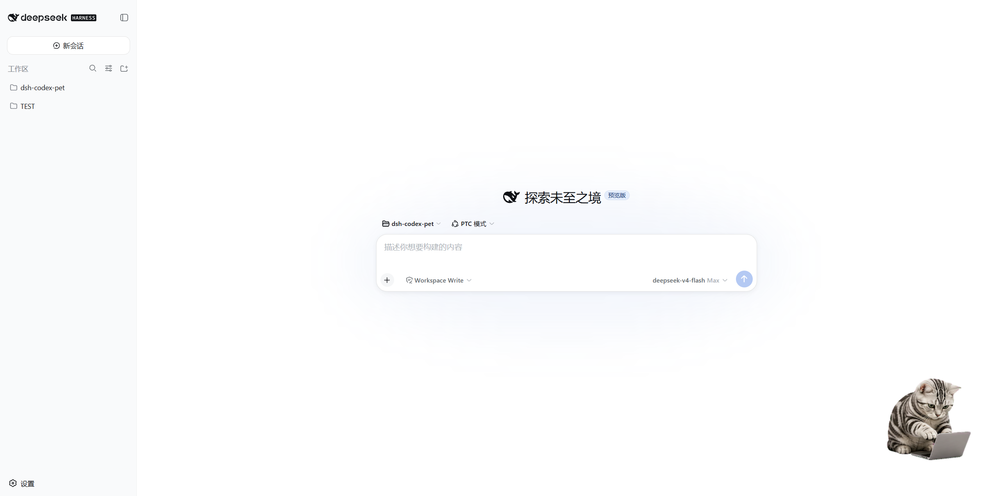
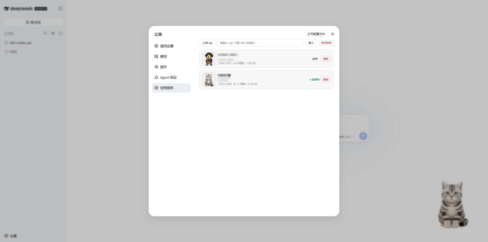

<p align="center">
  <strong>English</strong> · <a href="./README.md">简体中文</a>
</p>

# dsh-codex-pet

A **desktop pet** plugin for DeepSeek Harness (DSH): import Codex-style **sprite-sheet sequence-frame pets** and render them in the DSH Web GUI as a floating `shell.overlay` — with a pet library manager, basic interactions, and live Agent-state linkage.

## 📸 Preview

<!-- Screenshot 1: WebUI — the pet overlay at the bottom-right of the DSH Web GUI (1280×800) -->


<!-- Screenshot 2: Settings — the Pet Library page (list / upload / enable / disable / delete / URL import) -->


## ✨ Core Features

- **Sprite playback** — single WebP sprite-sheet (Format A), per-frame ms timing, row = animation (`idle` / `running` / `waiting` / `review` / `failed` / move / wave / jump).
- **Floating overlay** — bottom-right, draggable (viewport-clamped, position persisted), click to wave, idle random antics.
- **Pet library** (Settings → Pet Library) — zip upload / URL import / enable / disable / delete / first-frame preview.
- **Agent-state linkage** — subscribes to DSH session state: working → run (persistent); approval/question → waiting (pulse once); task done → happy (pulse once); task failed → sad (pulse once).
- **Dark/light theme** — all styles use `--dsw-*` theme tokens and adapt to the DSH theme automatically.

## 🎮 Usage

1. Open the DSH Web GUI (default http://127.0.0.1:3080).
2. **Settings → Pet Library** → upload / URL-import a pet zip → click **Enable**.
3. The pet appears at the bottom-right:
   - **Drag** to move (position auto-saved on release).
   - **Click** to wave.
   - **Agent linkage**: running while the agent works; a brief waiting pose when it needs your input; a brief happy pose on completion; a brief sad pose on failure.
4. To hide the pet: click **Disable** in the library.

## 📦 Install

### Option 1: pnpm (recommended)

```sh
dsh plugin add dsh-codex-pet
```

### Option 2: GitHub clone

```sh
git clone https://github.com/skr311/dsh-codex-pet.git
cd dsh-codex-pet
dsh plugin --profile web add ./packages/dsh-codex-pet
```

After installing, **restart the DSH Web GUI** (host-side changes need a restart; client bundles hot-reload), then refresh the page.

## 🛠️ Development

- **Layout** — `packages/dsh-codex-pet/` (host half `lib/index.js` + `pet-library.js`; client half `lib/client.js`; vendored `lib/vendor/fflate.mjs`).
- **Tests** (zero dependencies, plain Node + vendored fflate):

  ```sh
  node scripts/test-m2.js
  node scripts/test-m2-routes.js
  ```

- **Dev loop** — client bundle changes hot-reload via DSH HMR (no restart); host-side changes need a DSH Web GUI restart. See `docs/development-spec.md` and `AGENTS.md`.
- **Contributing** — see [CONTRIBUTING.md](CONTRIBUTING.md).
## 📚 Docs

- [docs/README.md](docs/README.md): index of the standard docs (Chinese); `AGENTS.md`: working guide; [docs/execution-steps.md](docs/execution-steps.md): milestone status.
- Asset format: [docs/asset-spec.md](docs/asset-spec.md). The repo does not bundle a sample sprite (copyright); tests build a synthetic WebP at runtime.

## License

MIT
